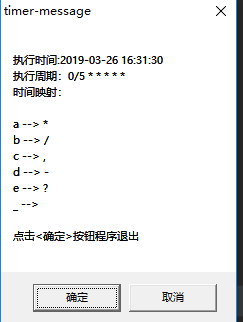

### timer-message

Simple windows timer to show message box.

#### build

- set CC and CXX env, better way download from : https://github.com/go-vgo/Mingw
- modify build.cmd CC CXX env
- call build.cmd 

#### how to use

- build
- modify exe name with timer setting to show message box, the timer cron use: https://godoc.org/github.com/robfig/cron
- cron special characters must replace with other:

```
a --> *
b --> /
c --> ,
d --> -
e --> ?
_ --> 

```
### example

timer-message(@hourly).exe to call every hour

timer-message(0b5_a_a_a_a_a).exe to call every 5 seconds




